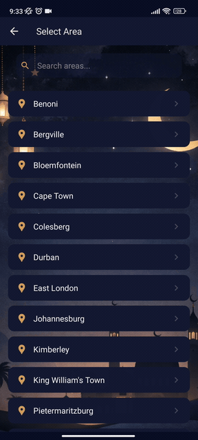

<div align="center">


# Reminder

**Prayer times for South Africa, on your phone.**

Reminder shows daily salah times for your area, tells you which way the Qibla is, and lets you know before each prayer comes in — so you never have to guess or go looking.



</div>

Built with [Expo](https://expo.dev) and [React Native](https://reactnative.dev). Android and iOS.

## What you can do

- **See today's prayer times** — Pick your area once; the app remembers it. Times are shown for the whole day at a glance.
- **Look ahead or back** — Swipe between days or jump to any date with the calendar picker. The Islamic (Hijri) date is shown alongside the Gregorian one.
- **Get reminded** — Turn on notifications and choose how many minutes before each prayer you want to be alerted. Pick a normal notification or a louder alarm-style alert.
- **Choose which prayers to be reminded about** — Hide the ones you don't need; the rest stay on.
- **Find the Qibla** — A live compass points toward the Kaaba using your location.
- **Read the 99 Names** — The names of Allah with their meanings, built into the app.
- **Make it yours** — Three themes with matching wallpapers: Light Mosque, Dark Mosque, and Serene Night.
- **Stay up to date** — The app checks for new versions and offers to update (Android).

Reminders keep working in the background: the app refreshes tomorrow's schedule daily, so alerts stay accurate without you opening it.

## Getting the app

Android builds are published on the [Releases](../../releases) page — download the APK from the latest release and install it.

## Where the times come from

Prayer times are sourced from [masjids.co.za](https://masjids.co.za/salaahtimes) and served through a Supabase backend. Once fetched, a month's times are cached on your device, so the app works offline for days you've already viewed.

## Permissions

| Permission    | Why it's needed                                  |
| ------------- | ------------------------------------------------ |
| Notifications | To alert you before each prayer                  |
| Location      | To work out the Qibla direction from where you are |
| Exact alarms  | So reminders fire at the right minute (Android)  |

Your area choice, settings, and cached times stay on your device. Location is used only to calculate the Qibla and is never stored or sent anywhere.

## For developers

### Prerequisites

- [Node.js](https://nodejs.org/) 20+
- Android Studio (Android) or Xcode (iOS)
- A `.env` with Supabase credentials

### Setup

```bash
npm install
npx expo start          # Start the dev server
npx expo run:android    # Run on Android
npx expo run:ios        # Run on iOS
npm run lint            # ESLint
npm test                # Jest (jest-expo)
```

### Project layout

```
app/                    # File-based routes (Expo Router)
  (tabs)/               # Home, Qibla, 99 Names
  areas.tsx             # Area selector
  settings/             # Notifications, appearance, preferences, about

src/
  components/           # Reusable UI
  hooks/                # Data fetching, notifications, Qibla, theming
  services/             # Supabase client, notification scheduling, GitHub releases
  stores/               # MMKV-backed persistence, one module per domain
  backgroundTasks/      # Daily reminder scheduling task
  theme/                # Presets, colors, component overrides
```

See [CLAUDE.md](CLAUDE.md) for architecture notes and code conventions.

### Tech stack

| Category      | Library                                  |
| ------------- | ---------------------------------------- |
| Framework     | Expo SDK 52, React Native 0.76           |
| Routing       | Expo Router (file-based)                 |
| UI            | @rneui/themed (React Native Elements)    |
| Storage       | react-native-mmkv                        |
| Notifications | expo-notifications, expo-background-task |
| Backend       | Supabase                                 |

### Build and release

Builds run on [EAS Build](https://docs.expo.dev/build/introduction/), driven by workflows in `.github/workflows/`: production Android/iOS builds, preview and dev builds, OTA updates via `eas update`, and a release job that pulls the APK from EAS and publishes a tagged GitHub release.
